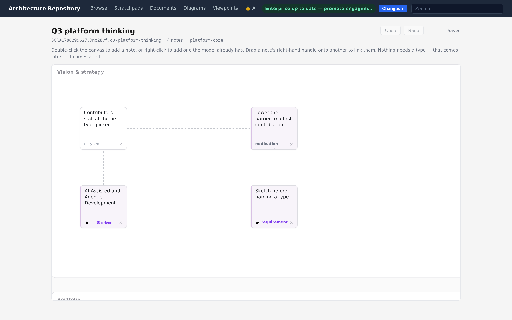
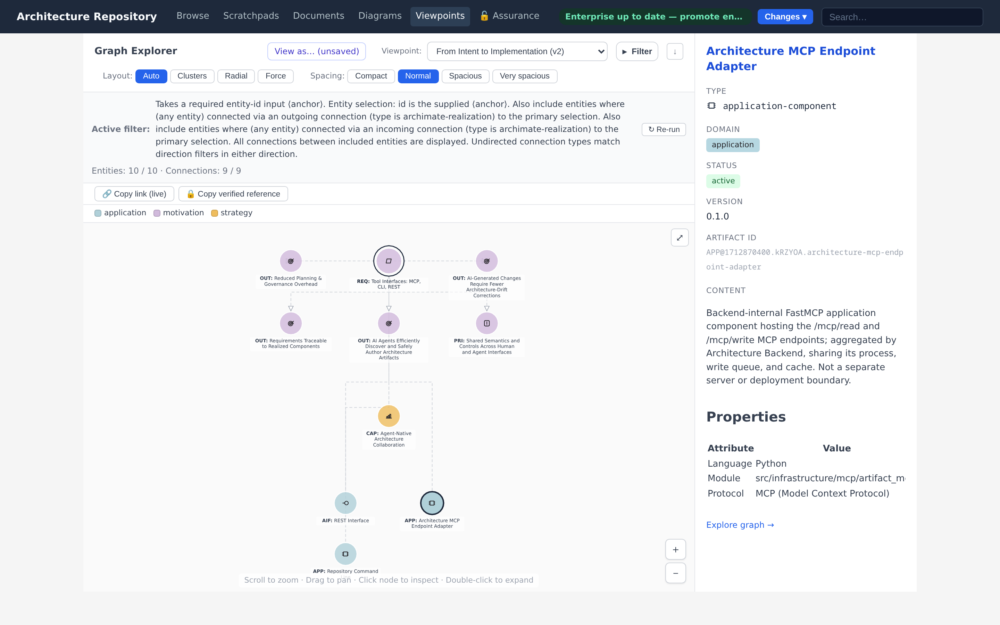
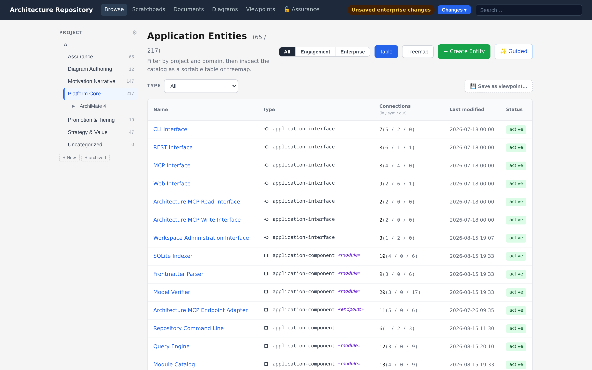

<div align="center">

# Architectonic

**Architecture — for humans and AI.**

Treat software architecture like code: a typed, git-versioned, verifiable model. Humans
edit in a browser, while AI agents edit through MCP tools — with safety, security, and compliance built in.

[](https://github.com/mbauer83/architectonic/actions/workflows/ci.yml)
[](https://codecov.io/gh/mbauer83/architectonic)
[](https://m8ven.ai/mcp/mbauer83-architectonic-ylj5mt)
[](LICENSE)
[](pyproject.toml)
[](tools/gui)

[](pyproject.toml)
[-2A6DB0)](pyproject.toml)
[](docs/03-modeling/interfaces-and-mcp.md)
[](docs/01-motivation.md)
[](docs/04-assurance/index.md)

[Quickstart](#quickstart) · [Documentation](docs/index.md) · [Why it exists](docs/01-motivation.md) · [Assurance](docs/04-assurance/index.md)

Sketch work before refining it.

<!-- media: docs/media/scratchpad-hero.png — seeded demo workspace, 1440×945 @2x; see tools/media/seed_scratchpad_hero.py -->


Then refine it into a verified model.

<!-- media: docs/media/hero-overview.png — deterministic capture, 1440×900 @2x -->


</div>

---

Agentic development makes implementation cheap and abundant, which moves the differentiating capacity to
*integration* — **sustaining unity of effort at agentic velocity** without making central approval
the bottleneck. Decks and spec files give an agent nothing reliable to query; modeling tools hold
the relationships but treat agent access as an afterthought. Architectonic makes architecture a
typed, verifiable graph that people and agents author through the same store, so teams can adapt
locally while their decisions stay checkable against shared enterprise intent.
[Why it exists →](docs/01-motivation.md)

The repository **models its own architecture**. The screenshots throughout these docs are the
tool describing itself: its components, requirements, decisions, diagrams — and its own
safety/security analysis — live in
[`engagements/ENG-ARCH-REPO/`](engagements/ENG-ARCH-REPO/) and the bundled assurance seed,
browsable in the running app and walked end to end in the
[showcase](docs/06-showcase.md). Where an illustration needs security findings the live
model doesn't currently have, they are synthetically seeded and visibly marked as such;
your own assurance content stays confidential by design.

&nbsp;

## Ask the model itself

Want to know something about this project — what it aims to achieve, whether it's for you,
what affordances it offers, or the important design and implementation decisions behind it?
Rather than reading the documentation, why not ask the model itself? 
Spin up the bundled demo ([Quickstart](#quickstart)), connect the `arch-repo-read` 
MCP server ([Give an AI agent access](#give-an-ai-agent-access)) to the AI model or agent of 
your choice, and ask it to explore the self-describing architecture model in the `ENG-ARCH-REPO` engagement 
repository to answer your questions.


&nbsp;

## Is this for you?

**It probably is, if…**

- you're a **single developer or you lead a small team** trying to move beyond ad-hoc prompts and
  semi-structured specs into architecture that can be queried, reviewed, and changed deliberately;
- you want **AI-native architecture & assurance modeling** based on a unified model, with equally
  capable human and agent access, so you can delegate tasks to an agent without losing the ability
  to check its work;
- you want **safety, security, and risk management** as a first-class, integrated part of your
  architecture modeling workflow, not an afterthought;
- you want to **get into architecture modeling** without adopting a heavyweight modeling-tool
  before the model has proved its value;


**It isn't (yet), if…**

- you need certified conformance to a **published ArchiMate standard** — the model aims for
  conformance with the [ArchiMate 4.0 standard](docs/reference/archimate-4-conformance.md),
  but this has not been independently verified;
- you want **WYSIWYG-first freeform diagramming** — diagrams here are typed views over the
  model, rendered by PlantUML and with limited styling options;
- you need a centralized modeling suite with fine-grained per-user accounts, **RBAC workflows**,
  and live-cursor co-editing as the primary collaboration model.

More on the audience in [Who it serves](docs/01-motivation.md#who-it-serves).

&nbsp;

## What you get

| | Capability | Details |
|---|---|---|
| ✏️ | **A scratchpad tier** | Somewhere to think before anything is typed: notes and links on a canvas, no ontology involved. What survives is lifted into verified model content — one-way, never synced back |
| 🗺️ | **A typed architecture graph** | Entities and connections across motivation → strategy → business → application → technology, geared toward the ArchiMate 4.0 standard | 
| 🔍 | **Browse and explore** | List, treemap, full-text search, and interactive graph navigation — *what connects to this, and how far to that?* |
| 📐 | **Diagram families** | ArchiMate views, C4 (model-backed), UML activity, sequence & class (datatype), and relationship matrices |
| 🎨 | **Read a diagram your own way** | Colour and annotate any diagram by any attribute its elements declare, with colours you pick and a legend drawn into the image — for the length of a visit, changing nothing, and exported exactly as shown |
| 🎯 | **Viewpoints** | Criteria-based ways of looking at the model — table/matrix/diagram/exploration, applied to existing diagrams or executed ad hoc, persisted or run on-the-fly |
| 🧭 | **Impact analysis** | *What is affected if this changes?* — indirect relationships derived across real ones per the ArchiMate rules, as parameterized default viewpoints and ad-hoc graph exploration |
| ✅ | **Always-on verification** | Schema, referential integrity, cross-repo rules, and PlantUML syntax checked on every write |
| 🤖 | **AI-native access** | A split read/write MCP server exposes the model as typed tools; the same capability is in the GUI and REST API |
| 🏢 | **Two-tier repositories** | Draft and manage local details in an engagement repo, promote curated content to a shared enterprise repo |
| 🛡️ | **First-class assurance** | Confidential STPA/CAST/GRC and FMEA analysis, linked to the model, with a tamper-evident archive. Failure modes attach to the hazards the analysis already states, so priority is derived rather than restated |
| 🔧 | **Operational upgrades** | `arch-repair upgrade` migrates repositories and deployment data across format changes — dry-run first, resumable, Docker-integrated |
| 🧩 | **Modular everywhere** | Pluggable ontologies, diagram types, schemata, and storage backends over a hexagonal core |

&nbsp;

## See it

The primary **ArchiMate** views are rendered from the typed model, so diagrams and catalog
entries stay tied to the same entity and relationship graph:

<!-- media: docs/media/diagram-archimate.png -->


UML-style behavior diagrams use the same verified diagram pipeline for activity, sequence,
and datatype views:

<!-- media: docs/media/diagram-activity.png -->


The **entity catalog** is filterable by project, domain, and type, with connection counts and
the specialization hierarchy shown inline:

<!-- media: docs/media/entities-list.png -->


More walkthroughs — graph exploration, diagram authoring, promotion, and assurance — are in
the [documentation](docs/index.md).

&nbsp;

## Quickstart

### The whole demo, in one docker command

Docker is the only prerequisite:

```bash
git clone https://github.com/mbauer83/architectonic.git && cd architectonic
docker compose -f docker-compose.demo.yml up -d --build
# port 8000 taken? publish on another: ARCH_DEMO_PORT=8100 docker compose -f docker-compose.demo.yml up -d --build
```

Then open **http://localhost:8000** - the docker image builds the GUI for you. That gives you the bundled self-describing model, the demo
enterprise tier, authoring guidance imported, and the encrypted assurance store created, unlocked
and seeded with the analysis that ships with the model — everything the manual route below does,
without a local Python or Java toolchain.

The demo is deliberately standalone: it uses its own image tag, its own volumes and its own compose
file, so it cannot disturb a `docker-compose.yml` you have configured for a real deployment, and the
two can run side by side (`ARCH_DEMO_PORT=8100` if 8000 is taken). The bundled model is mounted
read-only and copied into the demo's own `demo-data` volume on first start: authoring in the demo
edits that volume copy — never the files in your clone — and survives
`docker compose -f docker-compose.demo.yml down`, but `down -v` deletes the volume and with it
your demo work. See
[Docker Compose deployment](docs/reference/docker-compose.md) for the production file.


```bash
curl http://localhost:8000/api/stats
```

> **Note on the bundled demo.** Step 4 needs no configuration and no credentials: it resolves the
> two-tier workspace against the self-model bundled at
> [`engagements/ENG-ARCH-REPO/`](engagements/ENG-ARCH-REPO/) and clones the public
> [demo enterprise repository](https://github.com/mbauer83/global-architecture-repository) beside
> the workspace over https. You then have a populated model to explore, author against, and
> preview promotion with.
>
> What you cannot do against the demo is **complete** a promotion — it pushes a review branch and
> opens a pull request on the enterprise remote, which external users have no write access to.
> Point `arch-workspace.yaml` at your own engagement and enterprise remotes to exercise promotion
> end to end.

### Give an AI agent access

Point any MCP client (Claude Code, VS Code, …) at the two servers:

```json
{
  "mcpServers": {
    "arch-repo-read":  { "command": "uv", "args": ["run", "arch-mcp-stdio-read"] },
    "arch-repo-write": { "command": "uv", "args": ["run", "arch-mcp-stdio-write"] }
  }
}
```

The agent can then `artifact_query_search_artifacts`, walk the graph with
`artifact_query_find_neighbors`, and author with `artifact_create_entity` /
`artifact_add_connection` — every write validated by the same verifier the GUI uses. See
[Interfaces & MCP](docs/03-modeling/interfaces-and-mcp.md).

### Optional extras

- **Live security signals** for the seeded analysis: add `--with-signals` to step 6's
  `arch-assurance seed`. It generates SBOMs for the anchors the bundle declares and queries OSV,
  so it needs network access — left out of the quickstart for that reason. See
  [Security signals](docs/04-assurance/security-signals.md).
- **Your own authoring guidance**: step 5 pulls the published document named by
  `guidance.default_source` in `config/settings.yaml`. `--dry-run` reports what an import would
  write without writing it, `--source <url-or-path>` takes another document, and `--strict` turns
  any unknown or misplaced key into an abort — the mode to use when authoring one. See
  [Authoring guidance](docs/05-extensibility/guidance.md).
- **Other assurance backends** (PocketBase, private-git) and the TLP exposure ceiling are covered
  in [Assurance](docs/04-assurance/index.md) and
  [Storage & confidentiality](docs/04-assurance/storage-and-confidentiality.md).

&nbsp;

## Documentation

| # | Section | Contents |
|---|---|---|
| 1 | [Motivation, Ideas, Goals & Scope](docs/01-motivation.md) | Why the project exists; goals, principles, and explicit non-goals |
| 2 | [Installation & Setup](docs/02-installation.md) | Per-OS prerequisites, dependency groups, backend, MCP, quality checks |
| 3 | [Architecture Modeling](docs/03-modeling/index.md) | Projects, views, graph exploration, diagramming, viewpoints, the MCP/REST surface |
| 4 | [Assurance — Safety, Security, GRC](docs/04-assurance/index.md) | STPA/CAST/GRC/FMEA methods, assurance diagrams, confidential storage |
| 5 | [Extensibility](docs/05-extensibility/index.md) | Profiles, guidance, document types, ontology & diagram-type modules, hexagonal core |
| 6 | [Showcase](docs/06-showcase.md) | The platform's own model, walked from strategy to assurance |
| 7 | [First-model tutorial](docs/07-first-model.md) | From a running backend to a model that answers a real question |
| — | [Reference](docs/reference/configuration.md) | Configuration, CLI, [upgrades](docs/reference/upgrade-guide.md), git sync & promotion, [Docker Compose](docs/reference/docker-compose.md), [REST API](docs/reference/rest-api.md), [licensing](docs/reference/licensing.md) |

&nbsp;

## Status

Pre-1.0 and under active development. The model aims for conformance with the
[ArchiMate 4.0 standard](docs/reference/archimate-4-conformance.md), but this has not been independently verified or certified, so no claim to such conformance is made.

&nbsp;

## Roadmap

Under consideration:

- [ ] Internationalization of the GUI.
- [ ] Multi-language modeling content (localized entity names and descriptions).
- [ ] SPDX 3.0 AI-BOM export alongside the current CycloneDX ML-BOM.
- [ ] SysML v2 modeling. An experimental minimal meta-ontology exists but ships
      **disabled by default** (enable with `modules.sysml_v2_min.enabled: true`); first-class,
      supported SysML v2 is a considered future direction, not a current capability.
- [ ] Proposing changes to promoted content from an engagement deployment. Promotion currently runs
      one direction, once, per artifact: afterwards the enterprise copy is the authority and a local
      deployment can no longer propose anything about it.
- [ ] Rework of the packaged agent skills.
- [ ] Broader persona and scenario usability coverage. Modelling, decision support,
      implementation guidance, the assurance methods, and mixed-channel situations in
      which a person and a delegated agent work the same problem from different surfaces
      are still to be written included.
- [ ] A TOGAF-ADM inspired, workflow-graph (e.g. LangGraph) based multi-agent system for automated assistance across the whole software-development lifecycle that uses this project as its central knowledge graph.

&nbsp;

## Development & Quality Gates

Before committing, run the gates from the workspace root:

```bash
uv run pytest --tb=short -q
uv run ruff check src
uv run zuban check
```

Frontend checks (`npm run lint`, `npm run typecheck`) run from `tools/gui`. CI runs all of
these on every push and pull request.

&nbsp;

## How usability is checked (eval harness)

This repository carries a **persona and scenario framework** for
agent-based usability evaluation: declared target users, situations they meet the product in, 
the tasks those situations put to them, and an evaluator's answer key for each task.

A run puts one persona in one scenario, in one channel (the GUI, or the MCP surface an agent
sees), with nothing but a composed brief — no repository history, no knowledge of how the feature
was built. What it produces is a findings list scored on severity, how often the situation
arises, and whether the product would even let you notice the problem. The material is data
(`tools/usability_test/`: [personas](tools/usability_test/personas.yaml),
[scenarios](tools/usability_test/scenarios/), controlled vocabularies); the method is a skill
(`skills/usability-scenario-run/`).

**What this is and is not.** It is a repeatable way to catch the obstructions that a project at
this stage can otherwise only find by accident: the question a surface cannot answer, the affordance
that is missing, the dead end, the answer that requires knowing an internal name. It is emphatically
**not** a substitute for users. A simulated participant does not have a real practitioner's stake,
habits, context, or blind spots, and it will not tell you what people actually value. Treat the findings 
as leads, weighted by their scores — not as evidence of what users want.

**Real experience is how it improves.** Personas and scenarios are declarative files precisely so
that observed behaviour can be folded back into them: a misreading someone actually had becomes a
task in a scenario, an unanticipated constraint becomes a line in a persona's profile, a term people
kept stumbling over becomes a vocabulary entry. Pull-requests are not currently opened, as this is a personal project, but feedback is always welcome in the form of comments, personal communication or issues. 

&nbsp;

> **Trademarks and affiliation.** This is an independent open-source project. It is **not
> affiliated with, endorsed by, or sponsored by** any of the standards bodies or rights-holders
> whose notations and methods it supports. ArchiMate® is a registered trademark of **The Open
> Group**; UML® and SysML® are registered trademarks of the **Object Management Group (OMG)**;
> the **C4 model** is the work of **Simon Brown**; the **Goal Structuring Notation (GSN)**
> Community Standard is published by the **Safety-Critical Systems Club (SCSC)**; **STPA** and
> **CAST** are analysis methods developed at MIT. All trademarks, standards, and methods are the
> property of their respective owners and are referenced here only to identify the notations this
> tool interoperates with.

&nbsp;

## License

[MIT](LICENSE) © 2026 Michael Bauer
