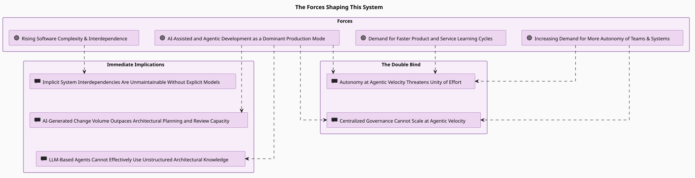
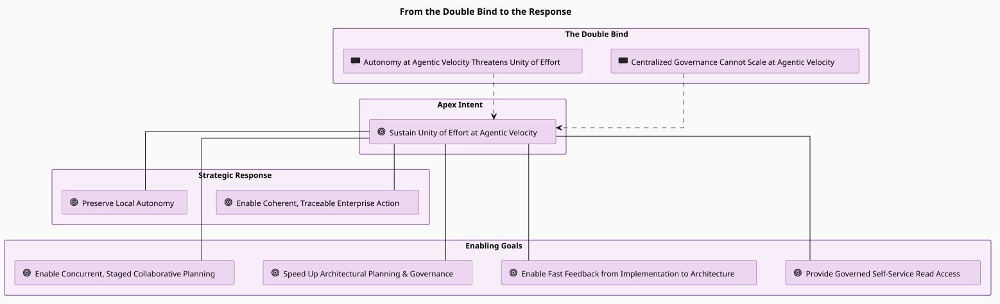
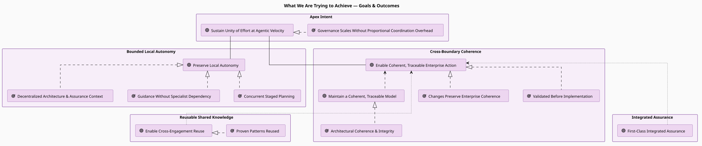

# Motivation, Ideas, Goals & Scope

This page is a condensed overview of the motivation for this project. Every driver,
goal, outcome, principle, value, and requirement summarized here is contained in the
project's self-model — see [`engagements/ENG-ARCH-REPO/`](../engagements/ENG-ARCH-REPO/),
browse it live through the GUI or the `arch-repo-read` MCP tools, or take the guided walk in
the [showcase](06-showcase.md).

&nbsp;

## From scaled execution to scarce integration

AI-assisted and agentic development has become a dominant mode of software production.
Turning a well-defined plan into working code — or making other well-defined changes — is
increasingly ceasing to be the costly bottleneck it used to be. What the result is worth,
however, still depends on how thorough, well-structured, contextful, and actionable the
specification was, and on what discovery and evaluation mechanisms are available to agents
for orientation as they work.

Persisted specs, cross-session memory, and retrieval over heterogeneous sources get us a
long way. But where important structure remains implicit and distributed across prose,
tickets, code, and conversations, agents have to reconstruct relations, priorities,
constraints, and dependencies again and again — fallibly, from partial, differently worded,
and potentially inconsistent information. Task-local performance improves; longer-term,
global coherence does not follow from it.

**Specifications scale execution. Architecture helps sustain unity of effort while execution
scales.** The rest of this page unpacks that sentence.

&nbsp;

## The forces at work

Four durable trends shape the problem this project addresses.

**AI-assisted and agentic development as the dominant production mode.** LLM-based coding
agents are becoming primary contributors, driving change at **agentic velocity** — the
combination of *change volume*, *number of concurrent work contexts*, and *feedback-cycle
rate* enabled by agentic development. This raises the volume of change not only in code but in
configuration, tests, documentation, infrastructure, and architecture-relevant decisions,
shifting the economics of production.

**Demand for faster product and service learning cycles.** Market and mission pressure
increasingly require enterprises to shorten the cycle between learning, product or service
decisions, implementation, and observed outcomes. That pressure raises the importance of both
local responsiveness *and* rapid cross-boundary integration.

**Increasing demand for autonomy of teams and systems.** Driven partly by the iteration speed
of agentic work, organizational design keeps moving toward more autonomy for teams and
subsystems — who then need to align semi-autonomously, without being bottlenecked by frequent,
highly centralized coordination.

**Rising software complexity and interdependence.** As systems grow, the dependencies between
components, services, teams, and stacks increase non-linearly. Tracing how a change in one
place ripples through the rest increasingly requires structured architecture work.

*Rendered from the self-model. Open the diagram in a running app:
[`the-forces-shaping-this-system`](http://localhost:8000/diagram?id=ARC%401777455142.cFB8Hs.the-forces-shaping-this-system).*

The immediate implications are structural: implicit interdependencies stop being maintainable
without explicit models, AI-generated change volume outpaces planning and review capacity, and
LLM-based agents cannot effectively use architectural knowledge that lives only in prose and
pictures. Two further assessments — shown as **the double bind** on the right of the diagram —
carry the core of the problem, and we return to them below.

&nbsp;

## Why unity of effort — and why architecture

The viability of any enterprise rests to no small extent on its effectiveness, efficiency,
and adaptability — and it rests on them *globally*, not merely locally. An enterprise can
contain locally effective teams and still be ineffective as a whole; highly efficient
components can coexist with enormous duplication and integration costs; individually
adaptable parts can produce a system that is increasingly difficult to change because their
dependencies and assumptions are no longer sufficiently understood.

**Unity of effort** names what closes that gap: differentiated, partially autonomous activity
staying sufficiently coordinated, mutually intelligible, and aligned for its combined effects
to keep serving the purposes and viability of the enterprise as a whole. Global coherence is
constitutive of it — concepts staying mutually intelligible across boundaries, dependencies
staying understood, local decisions staying compatible with cross-cutting constraints, and
work staying traceable to the motivations and requirements that justify it.

Underneath sits the old organizational interplay of *differentiation* and *integration*:

**The differentiation pull.** Teams and agents hold real worth in **local autonomy** — the
freedom to decide, at every level it recurs (business unit, team, developer-within-a-team),
over their own processes, standards, formats, communication structures, strategies, services,
and solutions. That autonomy is what buys **team solution fitness** (a team's work actually
solving its own domain problem well) and **local efficiency** (getting that work done with
proportionate effort). Uncoordinated, these can rise locally while pulling *against* the whole.

**The integration pull.** Unity of effort is what makes **enterprise adaptability** — the
capacity of the enterprise to change and re-shape itself as a whole — coherent rather than
chaotic, and what protects **enterprise efficiency and solution fitness** — delivering
offerings that fit real demand with proportionate resource. Both feed **enterprise
viability**, the enterprise's continued capacity to survive and thrive.

**Why it is a trade-off, not a menu.** Integration work — keeping interfaces, decisions,
semantics, and evidence coherent across boundaries — *costs* local efficiency in the short
term in order to *protect* it, and the fitness of the enterprise, over the medium and long
term. The trade-off view carries this as signed influences: autonomy erodes unity of effort
**(-) when uncoordinated**, and pursuing unity of effort taxes local efficiency
**(-) short-term** while protecting it **(+) medium- and long-term**. The punchline sits at
the top of the diagram: giving up the minimum necessary short-term local efficiency, at the
boundaries where it matters, is what keeps the enterprise viable.

*Rendered from the self-model. Open the diagram in a running app:
[`the-core-trade-off`](http://localhost:8000/diagram?id=ARC%401784849983.W6j62G.the-core-trade-off-local-autonomy-and-enterprise-adaptability).*

Architecture work — across enterprise, solution, and software levels — is one of the major
mechanisms through which that integration is made explicit and sustainable.
Enterprise-architecture languages such as ArchiMate deliberately span motivation and strategy
through business, application, and technology architecture, so participants can understand,
reason, and communicate about the structure, behaviour, orientation, and intent of the
enterprise and its projects.

&nbsp;

## The double bind at agentic velocity

As agentic systems join development, more of the scarce work becomes architectural: agentic
development increases code volume and iteration speed faster than enterprises can grow their
capacity for research, architecture modeling, planning, implementation guidance, and review.
And this holds even without new headcount — multiple agents operating across different tasks,
context windows, repositories, or branches are a form of differentiation of their own, each
worker acting on only a partial representation of the shared system. Against the forces
above, the trade-off hardens into a double bind — two failure modes that each look reasonable
locally:

- **Uncoordinated autonomy threatens unity of effort.** At agentic velocity, autonomous teams
  and agents can optimize locally while producing incompatible decisions and interfaces across
  boundaries. Autonomy is not the problem — *unintegrated cross-boundary effects* are. This can
  fragment products and customer-facing behaviour, but it can equally break integration among
  internal or externally consumed services *without changing a product feature at all*.

- **Centralized governance cannot scale at agentic velocity.** Routing routine decisions through
  centralized review and approval turns the coordination step into a throughput bottleneck at
  agentic volume and concurrency. Preserving throughput then forces a choice between suppressing
  local autonomy and responsiveness or weakening review — and neither sustains coherence.

Two further, related limits shape the design: **LLM agents cannot use unstructured architectural
knowledge effectively** (prose scattered across documents gives an agent no reliable way to
query, navigate, or verify intent), and **assurance disconnected from architecture loses
traceability** while struggling to keep pace with agentic development.

&nbsp;

## What the project aims for

The response is **bounded autonomy supported by structured architectural knowledge**: make
shared intent, interfaces, constraints, dependencies, decisions, and assurance obligations
explicit and machine-checkable, and keep decisions local unless their impact or risk justifies
wider coordination. The apex intent is to **sustain unity of effort at agentic velocity** —
*while local autonomy increases*, not by curtailing it.

*Rendered from the self-model ("From the Double Bind to the Response"). Open the diagram in a
running app:
[`the-story-in-one-view`](http://localhost:8000/diagram?id=ARC%401780220700.Un4jQZ.the-story-in-one-view).*

That apex splits into **two jointly pursued strategic goals** — *preserve local autonomy* and
*enable coherent, traceable enterprise action* — supported by four groups of goals:

**Bounded local autonomy**
- Preserve decision authority with teams and agents so they can adapt to their own situation.
- Provide governed, self-service read access to architecture for teams & agents.
- Speed up architectural planning and governance for agentic work.

**Cross-boundary coherence**
- Enable coherent, traceable enterprise action — what the enterprise decides, builds, operates,
  and presents stays coherent and mutually compatible, most critically where independently
  evolving products, services, processes, standards, and solutions meet across boundaries.
- Keep the *architecture model* itself a faithful, referentially sound, traceable representation
  — the **means** that *enables* coherent enterprise action, never an end in itself.
- Enable fast feedback from implementation back to architecture.

**Reusable shared knowledge**
- Plan concurrently in a staged repository system and enable cross-engagement reuse.

**Integrated assurance**
- Provide first-class assurance integrated with the architecture model, and lower the barrier to
  rigorous assurance work so specialist availability never becomes a central bottleneck.

&nbsp;

## Architecture at small-team scale

One consequence of agentic velocity is that explicit architecture becomes economically
relevant at smaller organizational scales. A handful of developers who communicate
continuously can keep a surprising amount of shared structure in their heads; but agentic
development multiplies concurrent workers, the rate of local decisions, and the breadth of
the system being changed without correspondingly increasing the number of humans who share
tacit context. Small teams now meet integration problems that used to be large-organization
problems — at the same time that agents make maintaining explicit architecture cheaper, by
updating descriptions and cross-references, checking consistency, deriving views, and
relating implementation changes back to the model.

This does not make dedicated architects less important — it makes routing every local
architectural decision through them an obvious bottleneck. Their leverage increases when
teams and agents work against explicit shared architectural knowledge: local work-in-progress
stays at engagement scope, and decisions or structures with wider relevance are *promoted*
into a governed enterprise view. That is the design pressure behind the two-tier repository
and the promotion workflow described below.

&nbsp;

## Guiding principles

Six principles constrain how the system is built.

**Shared semantics and controls across human and agent interfaces.** Human interfaces (GUI) and
agent interfaces (MCP, CLI, REST, RAG) operate over the same model, semantics, and controls, so
discovery, authoring, and verification mean the same thing and enforce the same rules regardless
of interface — without claiming full feature parity across every surface.

**Keep shared architecture explicit and machine-checkable.** Shared intent, interfaces,
constraints, dependencies, and assurance obligations are represented explicitly and in a form
humans *and* agents can check against with the same semantics. This is an availability
principle — it makes architecture usable for informed, agent-assisted checking *where
constraints apply*, enabling validation rather than universal gating; much local work has no
applicable machine-checkable constraint.

**Governance is proportional to impact and risk.** Governance and assurance effort scales with
the impact and risk of a decision, wherever they arise — high impact confined to a single team's
own solutions still warrants more governance; a boundary crossing is one source of impact, not
the criterion itself. Low-impact, low-risk work should not pay the coordination cost of
consequential change. This is qualified by the safety principle below: proportionality can
reduce unnecessary effort but never waive a mandatory safety constraint.

**Extensibility and configurability at multiple levels.** Frontmatter schemata, attribute
schemata, valid entity and connection types, guidance, profiles, and directory conventions are
configurable through git-based config at both enterprise and engagement scope. The ontology
extends beyond the base ArchiMate 4.0 vocabulary. The system adapts to an organization without
forking the core.

**Safety is never treated as subordinate to risk.** Safety constraints stay absolute — cost,
schedule, and risk-acceptance decisions cannot override them. A hard safety-disposition safeguard
runs on every assurance write to enforce this in the tooling, not just on paper.

**Assurance content is confidential by default.** Assurance artifacts, signals (SBOMs), and
references are encrypted at rest, TLP-tagged
([Traffic-Light Protocol](https://en.wikipedia.org/wiki/Traffic_Light_Protocol)), reachable only
through gated interfaces, and carry one-way references to architecture that are never
reverse-persisted.

&nbsp;

## Solution strategy

The strategy follows directly from those goals and principles.

- **Treat architecture as code.** Artifacts are structured, version-controlled markdown with
  typed frontmatter, committed to git with authorship and history — queryable, diffable, and
  reviewable like any other code.
- **Run a two-tiered repository.** An *enterprise* repo holds the organization-wide shared tier;
  per-project *engagement* repos hold local detail and draft work. An explicit, traced
  *promotion* step moves proven content up to the shared tier.
- **Make access AI-native.** An MCP server exposes the model to agents as typed tools, so an
  agent can query, search, navigate relationships, author, and promote without knowing the file
  layout — and humans get the same capabilities through a GUI, REST API, and CLI.
- **Verify continuously.** A built-in verifier enforces referential integrity, schema
  conformance, diagram syntax, and cross-repo reference rules on every write and on demand, so
  the model stays consistent while humans and agents edit it together.
- **Make assurance first-class.** Safety (STPA, CAST), security (STPA-Sec, supply-chain
  signals), and GRC analysis attach directly to the architecture entities they describe, stored
  confidentially and backed by a tamper-evident archive.

&nbsp;

## Assurance — obligations and opportunities

Two further forces reach beyond architecture proper. **Software and AI assurance obligations
keep expanding** — GDPR, NIS2, DORA, the Cyber Resilience Act, and the EU AI Act each add
documentation, traceability, and risk-management duties that increasingly reach smaller
organizations — while attackers use AI to scale operations that used to require far more human
time and expertise. And **small teams face a safety, security, and GRC capability gap**: the
method and legal expertise for rigorous assurance work is expensive, and dedicated tooling is
rare below enterprise scale.

This creates a natural point of contact between architecture and assurance. Security analysis
needs data flows and trust boundaries; enterprise views need goals, capabilities, and
dependencies; assurance needs traceability from hazards and obligations to requirements and
implemented controls. Methods like STPA, STPA-Sec, FMEA, and CAST all depend on sufficiently
thorough representations of the systems being analyzed — the same structure the architecture
model already holds. Instead of letting each concern reconstruct its own overlapping view of
the enterprise, this project attaches assurance analysis directly to the modeled architecture,
with viewpoints providing the selective relevance each role needs. See
[Assurance](04-assurance/index.md) for the capability itself.

&nbsp;

## Outcomes we expect

If the strategy holds, the effects preserve autonomy while integrating the whole. Several are
already demonstrable on the project itself — the [showcase](06-showcase.md) walks the self-model
as evidence.

*Rendered from the self-model. Open the diagram in a running app:
[`what-we-are-trying-to-achieve`](http://localhost:8000/diagram?id=ARC%401777452513.d8jG_4.what-we-are-trying-to-achieve).*

**Autonomy stays available while coherence keeps pace.** Any proposed change, regardless of
size, can receive automated, *informed but non-authoritative* validation against the relevant
architecture and assurance content, so most low-impact work proceeds on local judgment and only
genuinely consequential changes need wider coordination. Planning and governance overhead falls,
and governance scales without a matching rise in coordination effort.

**Changes preserve enterprise coherence.** With explicit, checkable architecture present, proposed
and enacted changes increasingly preserve interoperability, shared semantics, policy consistency,
and traceability — cross-boundary effects being the case where this matters most. Agents author
against a verified model and produce fewer architecture-drift corrections, and changes are checked
against the architecture — including applicable cross-boundary constraints and assurance
obligations — before they are built rather than after.

**The architecture becomes a shared, reusable asset.** Architectural guidance is available without
a specialist in the room, requirements stay traceable to the components that realise them, and
patterns proven in one engagement are promoted and reused across others.

**Rigorous assurance comes within reach.** Assurance findings stay traceable end-to-end to the
model, the friction and guidance overhead of safety, security, and compliance work drop, and the
analysis itself surfaces gaps in the architecture that were otherwise invisible.

&nbsp;

## Who it serves

The motivation layer names eight stakeholders: **Enterprise Leadership** (owner of the
enterprise-wide optimization and the portfolio-level trade-off between local autonomy and
whole-enterprise adaptability), **Architect**, **Developer**, **DevOps Engineer**, **Product
Owner**, **Upper Technical Management**, **Risk & Compliance Officer**, and **Safety / Security
Analyst**. The shared-semantics principle exists so each of them — and the agents working
alongside them — can reach the same model.

&nbsp;

## Scope and non-goals

**In scope**
- Modeling architecture toward the ArchiMate 4.0 vocabulary, plus extension ontologies and
  diagram families (UML activity, sequence, C4, matrices, and assurance views).
- A git-versioned, two-tier artifact store with a verifier, exposed through MCP, REST, CLI, and a
  browser GUI.
- A confidential, separately-stored assurance capability for safety, security, and GRC work,
  linked to the architecture model.

**Out of scope / deliberate non-goals**
- **Conformance claims.** The model aims for conformance with the
  [ArchiMate 4.0 standard](reference/archimate-4-conformance.md). Conformance has not been
  independently verified, so no conformance claim is made.
- **Full feature parity across every interface.** Each surface covers the core; depth varies by
  interface on purpose.
- **A hosted multi-tenant service.** This is workspace-local tooling backed by your own git
  remotes, not a SaaS platform.
- **Replacing your CI, issue tracker, or git host.** The promotion and review workflow is designed
  to sit on top of any git hosting platform without requiring API integration.

---

*Continue to [Installation & Setup →](02-installation.md) or jump to
[Architecture Modeling →](03-modeling/index.md).*
