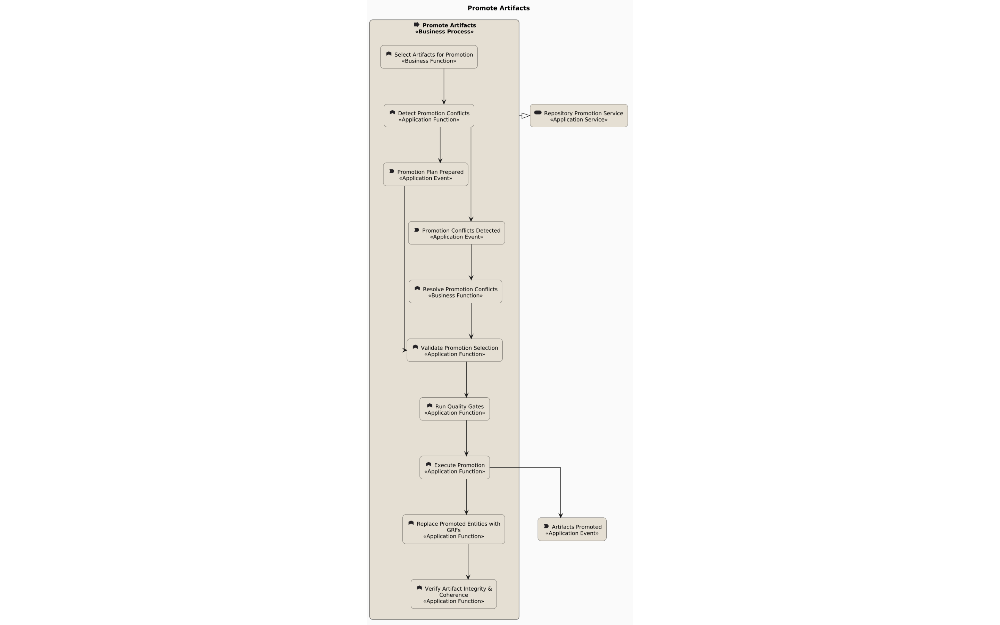
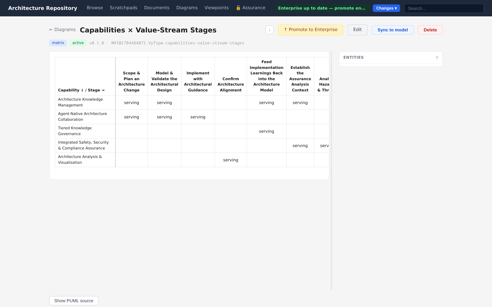
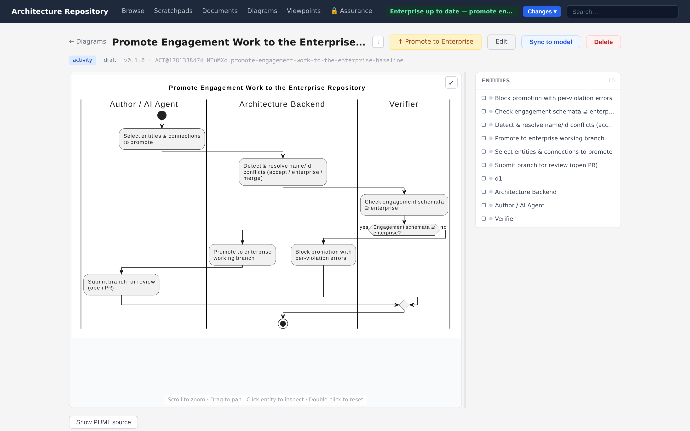
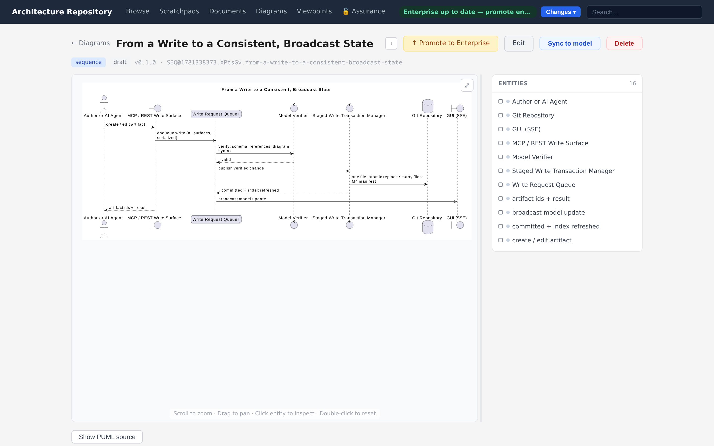
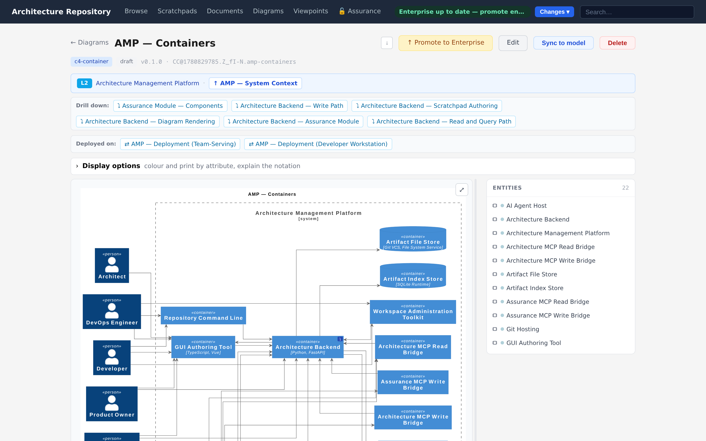

# Diagramming

Diagrams are views over the model. A **diagram type module** declares which entity and
connection types a view accepts and how it renders. Most ArchiMate views are config-only and
share the `GenericPumlRenderer`; families with their own notation (activity, sequence,
matrix, C4) bring a custom renderer. The full extension contract lives in
[`src/diagram_types/README.md`](../../src/diagram_types/README.md) and is summarized for
authors in [Diagram-type modules](../05-extensibility/diagram-type-modules.md).

Two kinds of content can appear in a view:

- **Model entities** — real entities from the store, referenced by `entity_id`. Editing the
  diagram never mutates them.
- **Diagram-only entities** — types that live only inside a diagram's `diagram-entities:`
  frontmatter (swimlanes, sequence participants, C4 boundaries). They are never written to
  the model store.

&nbsp;

## ArchiMate views

One view per domain — **motivation, strategy, business, application, technology,
implementation** — plus a **layered** view that spans all domains. These are config-backed:
each `config.yaml` sets the domain filter, grouping, and layout hints, and the shared
ArchiMate renderer handles stereotypes, glyphs, nesting, and flow arrows. Connection
descriptions stay hidden unless a diagram explicitly opts in per connection.



**Containment is drawn by nesting**, which is what the ArchiMate notation means by it: a composed
or aggregated element is drawn inside its container rather than beside it on a line. Nesting is a
tree, so an element is drawn inside exactly one container — where the model gives it more than one
(two groupings aggregating one environment, say), the first is nested and **the rest are drawn as
arrows carrying the containment's own notation**: a hollow diamond at the aggregating end, a filled
one for composition. The same fallback draws the containment of a member an
[authored group](#grouping-what-a-diagram-draws) has claimed. A containment the picture cannot nest
is never silently dropped, and `artifact_verify` refuses a body that declares one element twice
(**E318**) — PlantUML reads the second declaration as a reference, which would empty the second
container without any error.

**In ArchiMate views, colour says which domain an element belongs to and corner shape says what
kind of thing it is** — square for structure elements, rounded for behaviour, cut corners for
motivation. The ArchiMate meta-ontology declares one colour per domain and assigns each corner
style to the element classes its types already carry; borders and container tints are derived from
the declared colour rather than listed beside it. A meta-ontology that declares neither renders
plainly, and one that declares its own brings its own palette and categories with no code change —
this is a property of the declaration mechanism, not of ArchiMate. `GET
/api/ontology/element-appearance` serves the resolved answer for whichever meta-ontology governs:
colour per domain, corner style per entity type.

Diagram families with their own renderer (activity, sequence, matrix, C4, datatype, GSN) draw in
their own notation and are unaffected by the domain palette.

**A relationship's line and end markers are declared the same way.** Each connection type states
its notation structurally — `dashed`, `hollow-triangle at the target` — and its PlantUML spelling
is derived from that statement, so a rendered diagram and the graph explorer cannot draw the same
relationship differently. ArchiMate itself assigns no formal meaning to colour and defines no
palette; the values here are this product's declaration.

A diagram connection's frontmatter entry can opt in to an inline **multiplicity** annotation
(`include_multiplicity`) rendering its source/target cardinality on the arrow — the ArchiMate
4.0 term for what earlier releases of this project called "cardinality" (the annotation key
itself was renamed for the same reason; there is no dual-key support, see
[CLI & Backend → Deprecations](../reference/cli-and-backend.md#deprecations)). Entities and
connections carrying a [specialization](../05-extensibility/ontology-modules.md#specializations)
render an additional guillemet stereotype (`«Business Collaboration»`) alongside the type
stereotype, with the specialization's own icon/color/line-style notation overriding the
parent type's where declared.

&nbsp;

## Applying a viewpoint

Any diagram or matrix can be pinned to a [viewpoint](viewpoints.md) definition via its
`viewpoint:` frontmatter, non-destructively flagging placed entities/connections that fall
outside the definition's scope or query — ghosted, warned, or ignored depending on the
effective enforcement setting. See [Viewpoints](viewpoints.md) for the full model.

&nbsp;

## Matrix

A free-ontology view that accepts every entity type and renders as a Markdown table rather
than PlantUML. Use it for relationship matrices — for example, requirements against the
components that realise them, or stakeholders against concerns. Authored and edited through
the dedicated matrix create/edit flow.



&nbsp;

## Activity (UML)

A UML activity view with **swimlanes** as diagram-only entities. Actions are placed in lanes,
lanes map to model roles or actors, and notes attach to steps. Structural relationships
(step-in-lane, note-of) are stored in the diagram's `connections:` list, not as properties,
and the custom renderer builds the swimlane layout from them.



&nbsp;

## Sequence (UML)

A UML sequence view with participants and ordered messages, linked by stable local ids. The
GUI provides a bespoke editor (wired through the diagram type's `type_ui_slots`) for adding
participants and messages without hand-editing frontmatter.



&nbsp;

## Datatype (UML class)

A restricted UML class diagram for modeling data structures and their relationships. The
diagram owns five **diagram-only connection types** (`dt-association`, `dt-aggregation`,
`dt-composition`, `dt-generalization`, `dt-dependency`) and five **classifier kinds**
(`class`, `datatype`, `enumeration`, `variant`, `primitive`).


Attributes are addressable, not just drawn. Clicking a row inside a classifier selects that
attribute and opens its record — its type, multiplicity, key membership, role and provenance —
so the structural picture and the field-level detail are the same artifact rather than a
diagram plus a spreadsheet. Above, `Artifact.artifact_id` carries the identity role that every
artifact id in the repository obeys: `PREFIX@epoch.random.slug`, immutable and rename-free.

Each classifier may be **bound** to a Data Object entity in the model store, recording that
the diagram's structural depiction corresponds to a specific model element. When both ends of
a `dt-*` edge are bound, the system enforces **§3.2 consistency**: the edge must have a
**backing model connection** whose `relationship_kind` matches the `dt-*` type:

| dt-* type | Relationship kind | Compatible backing types (examples) |
|---|---|---|
| `dt-association` | association | `archimate-association` |
| `dt-aggregation` | containment | `archimate-aggregation` |
| `dt-composition` | containment | `archimate-composition` |
| `dt-generalization` | generalization | `archimate-specialization` |
| `dt-dependency` | dependency | `archimate-association` |

Two error codes enforce this invariant:

- **E330** (forward) — a `dt-*` edge between two bound classifiers has no backing connection.
  The GUI editor shows an inline "Create & bind" quick-fix: clicking it creates the preferred
  backing connection between the two Data Objects and records the binding automatically.
- **E331** (reverse) — a recorded backing connection has the wrong `relationship_kind` or
  points the wrong direction.

Both errors surface through the standard verification flow (inline in the GUI, structured
`details` and `actions` fields in the MCP/REST response) and clear as soon as a correct
binding is in place.

Authoring via MCP: pass `diagram-type: datatype` to `artifact_create_diagram` or
`artifact_edit_diagram`. Use `artifact_authoring_guidance(filter=["classifier"])` to see the
accepted vocabulary. The legacy `er-*` connection types are deprecated; new diagrams should
use the `dt-*` family.

&nbsp;

## C4

A progressive zoom across three levels — **system context** (L1), **container** (L2), and
**component** (L3). C4 views are **model-backed**: a projection engine derives view content
from the ArchiMate graph (a software system, its containers, its components), so the diagram
stays consistent with the model. Parent/child navigation moves between levels, and a
preview/refresh path shows what a projection will include before it is saved.

Node descriptions are **off by default** — C4 nodes render name only. Set
`show_node_descriptions: true` in the diagram's frontmatter to include the description line
under the name.

C4 containers and components support a **shape** property that maps to C4 PlantUML macros:

| Shape value | Rendered as | Best for |
|---|---|---|
| *(empty / default)* | `Container` / `Component` | Generic box |
| `Container/ComponentDb` | `ContainerDb` / `ComponentDb` | Databases, file stores |
| `Container/ComponentQueue` | `ContainerQueue` / `ComponentQueue` | Message queues, event buses |

The `shape` field is a dropdown in the create view. Setting `external: true` on any entity
appends the `_Ext` suffix automatically (`ContainerDb_Ext`, etc.).



&nbsp;

**Edit view sidebar.** Opening an existing model-backed C4 diagram in the edit view populates
the sidebar with the **derived entities** (grouped by role: software systems, containers,
components, actors) and the **read-only connections** between them. Entities in the sidebar
are those the projection found in the model — adding or removing them in the model updates
what appears on a refresh.

&nbsp;

## Viewer interactivity

The rendered SVG viewer is interactive for C4 diagrams and any architecture-repository GSN
diagram:

- **Click a node** — the detail sidebar opens with the entity name, type badges, description,
  and connections. C4 nodes are identified by `data-entity-id` attributes attached when the
  SVG is rendered.
- **Click an edge** — the connection flow detail opens, showing the relationship kind and both
  endpoint names.
- Clicking a second element deselects the first; clicking the same element toggles it off.

Assurance diagrams (bowtie, control structure, UCA matrix) have the same selection UX inside
their own assurance viewer — see [Assurance diagrams](../04-assurance/diagrams.md).

&nbsp;

## Authoring a diagram

The GUI authoring flow is the same shape across families:

1. **Pick entities** through a search filter scoped to the view's accepted types.
2. **Expand related entities** — pull in neighbours of what you have already placed.
3. **Manage connections** side by side with the entity list.
4. **Preview the PlantUML live**, then render to SVG.

Rendered SVGs are interactive: click an entity to open it, and follow its relationships
visually.

Agents get the same capability through the MCP write tools, plus two helpers:

- **`artifact_diagram_scaffold`** — produce a starting diagram skeleton for a chosen type.
- **`artifact_authoring_guidance`** — return each diagram type's `when_to_use` /
  `when_not_to_use` guidance and accepted vocabulary, so an agent picks the right view before
  authoring.

### Changing what a diagram draws

On both `artifact_create_diagram` and `artifact_edit_diagram`, **`entity_ids` is the diagram's
membership**: exactly those entities are drawn, and the generated body is rendered from them. So
dropping an id from the list on an edit removes the element from the picture, along with any
connection that loses an endpoint — there is no separate step, and no need to delete and recreate the
diagram. `connection_ids` omitted means "whatever the model connects these members with"; pass it
explicitly to narrow that.

Three kinds of diagram own their picture differently, and for those the request is **refused** with
the operation that does work, rather than changing the recorded references and leaving the body
showing something else:

| Diagram | Membership lives in | Change it with |
| --- | --- | --- |
| Model-backed (has a `scoped-by` binding) | the model, through the projector | the binding's target, then `puml="auto-sync"` |
| Standalone (has `diagram-entities`) | `diagram-entities` | `diagram_entities=…` |
| `manual-layout: true` | the author's body, kept verbatim by sync | `puml=…` in the same call, or `manual_layout=false` |

Passing `puml` alongside `entity_ids` is a different request and behaves as it always has: the caller
supplies the body, and the recorded references are reconciled against what it draws.

### Grouping what a diagram draws

A diagram can draw **labelled boxes the model does not hold**. The label is the point: a box called
"Write Requests" says something no element type does, so a grouping is content, not layout. Pass
`authored_groupings` to `artifact_create_diagram` or `artifact_edit_diagram`, or use the Groupings
panel in the GUI's diagram authoring flow; the list replaces the diagram's boxes wholesale.

```yaml
authored-groupings:
- label: Forces
  entity-ids: [DRV@…, DRV@…]        # one domain  → that domain's look
- label: Cross-cutting
  entity-ids: [APP@…, DRV@…]        # several     → the dashed ArchiMate grouping look
- label: Outer
  entity-ids: [GOL@…]
  groups:                            # boxes nest, to any depth
  - label: Inner
    entity-ids: [OUT@…]
```

Three things the declaration does not have to say:

- **How it looks.** The look is derived from the members — all in one domain gives that domain's
  background and border, members from several give the ArchiMate grouping notation (dashed, no
  fill). A subgroup's members count towards its ancestors, because a box is one thing however deep
  it goes. An explicit `stereotype` is still honoured for a deliberate exception; nothing in this
  repository needs one.
- **Which drawing it means.** A member may name an **occurrence id** as well as an entity id, so an
  entity [drawn twice](#archimate-views) can sit in a different box each time. Each drawing belongs
  to one box — the first declaration wins.
- **That it is flat.** `groups` nests.

Membership in a box beats modelled containment: the composition stays in the model, and the picture
keeps the box you asked for.

See [Interfaces & MCP](interfaces-and-mcp.md) for the full tool surface.

---

*Next: [Viewpoints →](viewpoints.md)*
