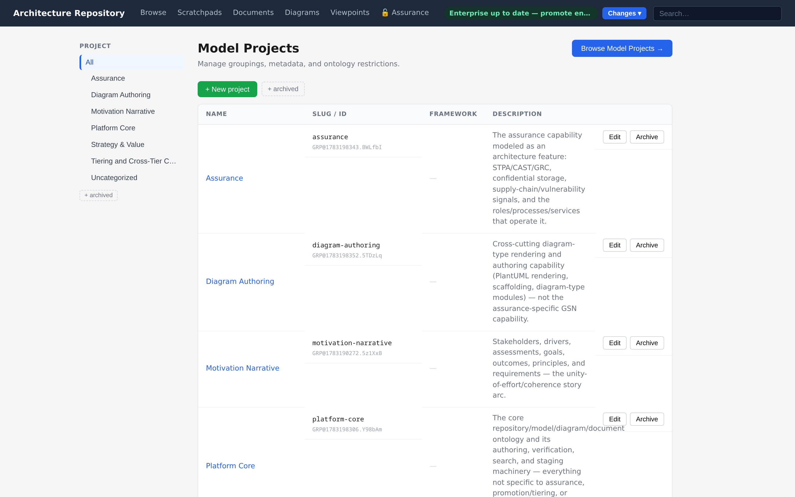

# Projects & Grouping

Growing repositories stay navigable through **three independent grouping axes**, one per
artifact family.

| Axis | Artifact family | Directory layout |
|---|---|---|
| **Model-project** | Entities + connections | `projects/<slug>/model/<domain>/<type>/…` |
| **Diagram-collection** | Diagrams | `diagram-catalog/diagrams/<slug>/…` (+ `rendered/<slug>/`) |
| **Document-collection** | Documents | `docs/<doc-type-subdir>/<slug>/…` |

The axes are mutually independent — a diagram collection is never tied to a model-project.
Grouping is a **soft partition**: it controls where files live and nothing else. Search,
linking, and verification ignore group boundaries entirely.

Groups exist at both tiers — each repository carries its own group registry. Promotion
maps each engagement group to an enterprise group: a group promoted before is matched by
its registry id and receives the new content in place; a same-slug enterprise group with
a different identity is flagged as a conflict to resolve; and a group new to the
enterprise tier is created with an engagement-qualified default slug
(`{engagement-label}-{slug}`), so two engagements that independently named a group
"assurance" cannot silently merge. The promoting user can override any mapping — for
example to merge into an existing enterprise group deliberately. See
[Git sync & promotion](../reference/git-sync-promotion.md#promotion).



&nbsp;

## Scratchpads are free-standing, and a lift chooses per frame

A [scratchpad](scratchpad.md) lives at `scratchpads/<slug>/`, and that slug is a **model-project
slug reused as a directory name** — there is no fourth grouping axis and no scratchpad registry.
Filing one somewhere is not the same as scoping it: a scratchpad is deliberately **not scoped to a
model-project**. Portfolio and strategy work is cross-project by
nature, and scoping a scratchpad to one project would make the most valuable material — the thinking
that spans projects — the awkward case.

Model content *is* scoped, so the scoping decision moves to the **lift**, and it is made **once per
frame** rather than once per lift. The frames are work archetypes: vision and strategy work is
cross-project, project work belongs to one project, enabling work is shared. A lift may name a
project that does not exist yet and create it — *"this thinking has become a project"* is the normal
way a project starts — carrying the scratchpad's meta-ontology, so a later lift can still detect a
mismatch. A project declaring a different meta-ontology is refused rather than coerced.

A lift spanning four projects is still one batch and one transaction, because a group is a property
of each written item rather than of the write.

&nbsp;

## Working with groups

**Lifecycle** — through the `artifact_group` MCP tool or the REST `/api/groups` endpoints:

- `create` — register a new group (target = slug)
- `rename` — change display name or slug (safe subtree `git mv`)
- `archive` / `unarchive` — hide or restore from default pickers
- `delete` (diagram / document collections) — remove folder + contents; typed confirmation
  required
- `delete` (model-project) — a cascade that also removes the connections into the project and
  rewrites the diagrams that referenced it; the impact report lists what it would touch

Every action takes `dry_run`, which defaults to `True`: the operation is validated and reported, and
nothing is written. Pass `dry_run=False` to carry it out. The answer names both `dry_run` and
`wrote`, so a caller can tell a preview from a completed change without inspecting the repository.

**Create or edit with a group** — `artifact_create_entity`, `artifact_create_diagram`,
`artifact_create_document`, and their `edit_*` counterparts all take an optional `group`
parameter:

- at create time, the artifact is placed in that group's directory
- at edit time, the artifact is re-homed to a new group with a safe `git mv`

Group authoring is intentionally out of scope for the CLI; use the MCP tools or the REST/GUI
surface.

&nbsp;

## Migrating existing content

Migration into the grouped layout is idempotent and per-repo:

```bash
uv run python -m src.infrastructure.workspace.migrate_to_groups
```

---

*Next: [Views & exploration →](views-and-exploration.md)*
