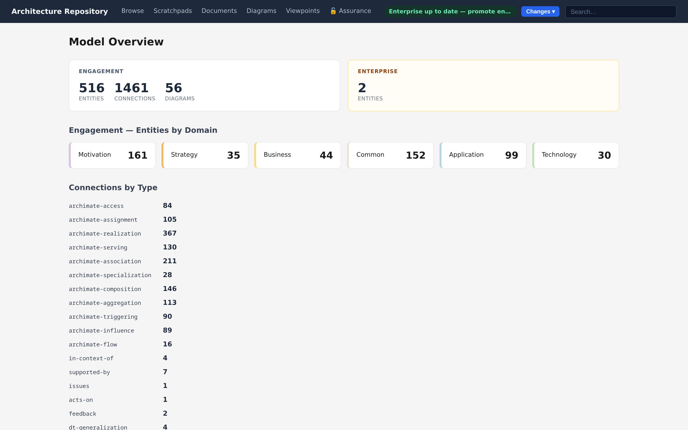
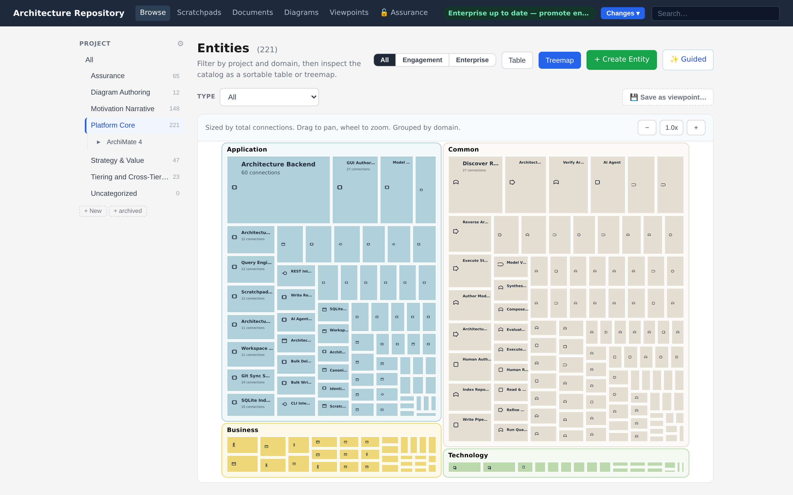
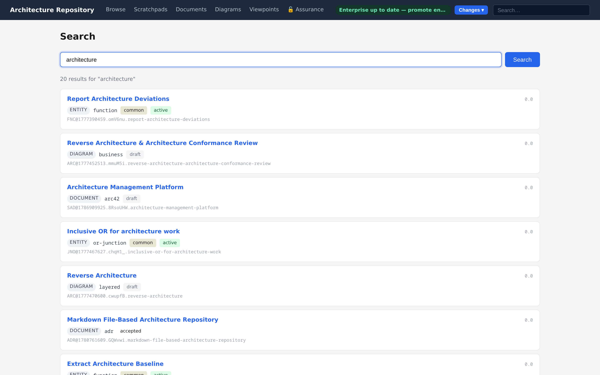
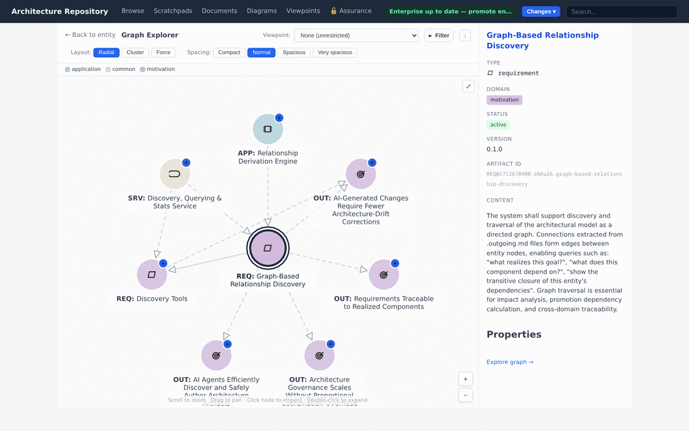
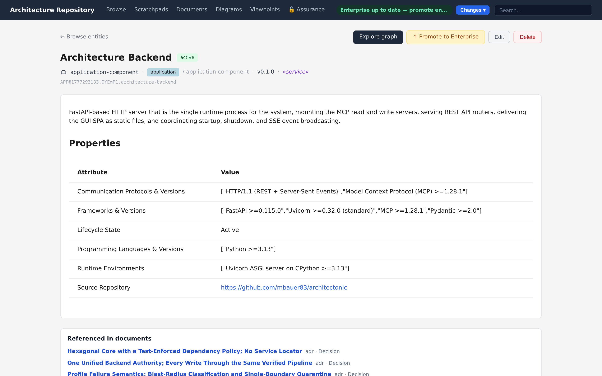

# Views & Exploration

The same artifact store is browsable several ways. Each view is available in the GUI for
people and as structured data through the MCP and REST surfaces for agents.

&nbsp;

## Overview

The home view summarizes the workspace: engagement versus enterprise counts, and breakdowns
by domain and connection type. It is the fastest way to confirm what a repository contains
and which tier you are looking at.

&nbsp;

## List view

A filterable, sortable table of entities (and parallel list views for documents and a grid
for diagrams). Filter by domain, type, status, and keyword; full-text search narrows the
list as you type.

Every list surface carries the same **tier facet** — `All · Engagement · Enterprise`
(viewpoints add their built-in `module` tier) — persisted in the URL as `?tier=`, so a
copied link restores the exact tier you were looking at. Rows show a uniform tier badge,
and the enterprise tier is browsed through the same views rather than a separate section.
Engagement collections (groups) apply only outside the Enterprise tier; selecting
Enterprise clears the active collection.

Columns sort by clicking their header — ascending, descending, then back to the repository's
own order. **Name, Type, Domain, Status, and Last modified are ordered by the backend over the
whole filtered population**, before the page is cut, so "most recently changed" means the most
recent in the repository and not merely on the page you happen to be on. The **Connections**
column is the exception: its in/sym/out counts are computed for the loaded rows, so its header
says *this page only* rather than implying more than it can deliver. **Last modified** shows the
UTC instant an artifact was last written (hover for the exact stamp), or "—" for an artifact that
carries none.

&nbsp;

## Repository workflow & status

The top bar's right side is the **workflow/status cluster**: a repository status chip
plus a **Changes** menu. The chip reports the working state — including a warning when
the enterprise working branch is behind its remote — and the menu holds every workflow
verb in one place: *Save engagement changes*, *Save enterprise changes*, *Submit for
review*, *Discard working branch* / *Discard submission*, and *Promote to enterprise*.
Nouns live in the left navigation; verbs live here. The cluster is fail-closed: until
the backend has confirmed what the current session is allowed to do, no verb is
offered — a connectivity or status failure can never present an action that would be
rejected. The save/submit/promote semantics behind these verbs are described in
[Git sync & promotion](../reference/git-sync-promotion.md).

&nbsp;

## Treemap

A space-filling map of entities, sized and grouped so the shape of a repository is visible
at a glance — which domains and types dominate, and where the gaps are. Drill in to focus a
domain or type.

&nbsp;

## Search

Full-text search across every artifact family (entities, connections, diagrams, documents)
with relevance ranking, plus optional semantic supplement where configured. Results carry
enough metadata to act on without a second round-trip. System-managed bookkeeping
artifacts (such as the cross-repository reference proxies created by promotion) never
appear in results — search surfaces only content someone authored.

&nbsp;

## Graph exploration

Relationships are first-class. The graph explorer starts from any entity and lets you walk
the connection graph interactively: *what connects to this, and how many hops to reach that
concept?* Expand a node to pull in its neighbours, follow specialization / composition /
aggregation hierarchies, and trace cross-domain dependencies that would otherwise stay
implicit.

The graph draws **every relationship among the entities it is showing**, not only the ones incident
to what you expanded. Two people looking at the same set of nodes therefore see the same graph,
whatever order they clicked in.

### Filtering

Completeness is the default and the filter is how it stays readable. **Filter** sits above the
canvas and offers only the values actually present in the graph you have loaded, so the choices
follow your exploration: expand a node that brings in a new domain and that domain joins the list.

Values are grouped by what they classify — elements and relationships — and within that by the
levels the meta-ontology declares. For ArchiMate that is domain, entity type and specialization on
the element side, and relationship type and specialization on the relationship side. A different
meta-ontology declaring a different chain is offered its own levels, under its own labels; the
filter reads what each level says about where its values come from rather than knowing any level by
name.

Selecting a value excludes it. An element that is hidden takes its relationships with it, since a
line to a node that is not drawn says nothing. The reverse holds too: excluding a relationship type
also removes the elements it leaves with nothing to show, so filtering down to one kind of
relationship gives you that structure rather than that structure surrounded by unconnected boxes.

Excluding a relationship type also removes anything it **cuts off from the element you are
exploring** — not only elements left with nothing, but whole clusters left with no surviving path
back. The graph explorer is a walk: everything on it arrived by being reachable from your subject,
and the radial layout places elements by hop distance from it. A cluster with no path back has no
hop distance, so leaving it on screen draws it as though it were one hop further out than
everything else.

Two things are never removed this way. An element that had no relationships to begin with stays,
since the filter took none from it. And the element you are exploring stays, whatever you exclude —
it is the subject of the view.

Because the consequence is not proportional to the cause — excluding one relationship type can take
a third of the graph with it — the control reports how much survives: `Filter · 1 excluded · 22 of
27 shown`.

The collapsed control always reports what it is doing — `Filter · 3 excluded`, with **Clear** beside
it — so a graph is never quietly incomplete. (Clear empties the filter; the viewport's **Reset**,
top right, re-frames the graph. They are different controls and say so.)

The selection lives in the address (`?hide=entity_type:driver`), which makes a filtered graph a link
you can send. Nothing is removed from the model; only from the picture.

For agents, the same traversal is available through `artifact_query_find_neighbors` and
`artifact_query_find_connections_for` — see [Interfaces & MCP](interfaces-and-mcp.md).

&nbsp;

## Entity detail and connection authoring

Opening an entity shows its full content, properties, and connections grouped into
**incoming**, **symmetric**, and **outgoing**. Each connection type the ontology permits for
this entity gets its own row with a **+** to add a connection and an inline **×** to remove
one, so relationships are authored where the entity lives rather than in a separate editor.
The permitted target types come straight from the connection ontology, so the editor only
offers links the verifier will accept.

---

*Next: [Diagramming →](diagramming.md)*
