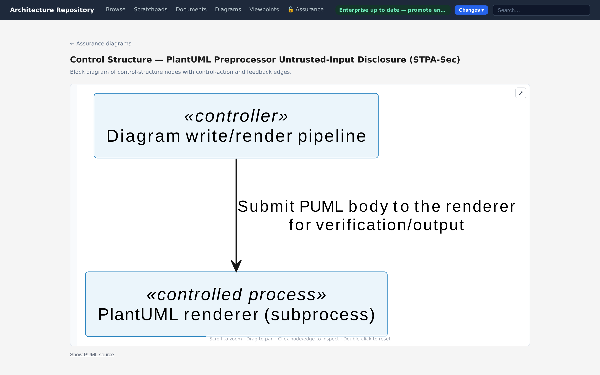
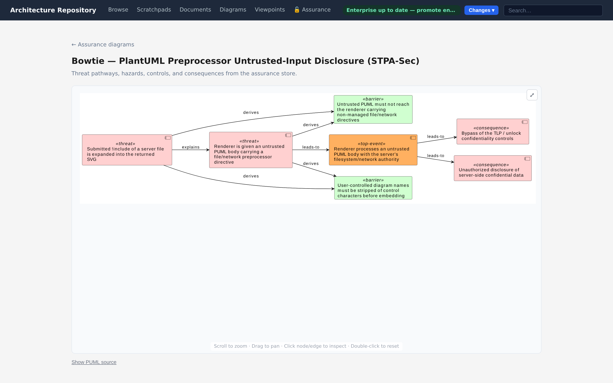
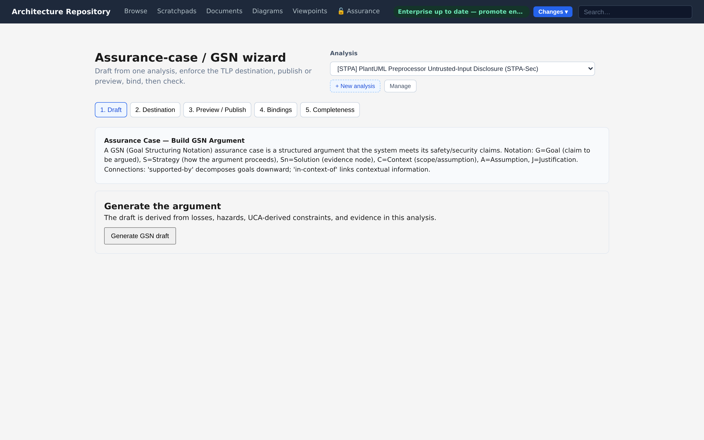

# Assurance Diagrams

Five diagram families visualize an assurance analysis, each a diagram type module under
`src/diagram_types/`.

| Diagram | Module | Reads from | Viewer |
|---|---|---|---|
| STAMP control structure | `control_structure` | Control-structure nodes + control actions | Assurance viewer |
| UCA matrix | `uca_matrix` | Control actions × STPA guidewords | Assurance viewer |
| Failure-mode matrix | `fmea_matrix` | Candidate elements × failure guidewords | Assurance viewer |
| Bowtie | `bowtie` | A hazard, its threats, consequences, and barriers | Assurance viewer |
| Assurance case (GSN) | `gsn` | Goals, strategies, solutions/evidence | Generic + assurance bridge |

Assurance diagrams are **never written as plaintext to disk** — the renderer refuses to emit
into `diagram-catalog/rendered/`, keeping confidential analysis out of the clear. The figures
below are the project's **own** STPA-Sec analysis of its confidential assurance store
(a worked, self-describing example), rendered for this documentation.

&nbsp;

## Unified assurance diagram viewer

Bowtie, STAMP control structure, UCA matrix and failure-mode matrix open in the **assurance
diagram viewer**, not in the generic architecture diagram viewer. This surface:

- Applies the `AssuranceExposurePolicy` to every response — nodes and edges above the
  configured TLP ceiling are never sent to the client.
- Renders the diagram from the live store graph rather than a stored `.puml` file, so it
  always reflects the current analysis state.
- Supports **interactive node and edge selection**: clicking any node or edge opens an
  assurance detail panel beside the diagram with the node's name, type, status, description,
  architecture bindings, and a link to the full node-edit view.
- Falls back to a selectable store-grounded entity list when PlantUML is unavailable.

### Overview, then one diagram at a time

`/assurance/diagrams` is an **overview**: one card per available projection, with its title and
what it shows. No diagram renders there, so opening the overview costs one catalog read rather
than a store projection you did not ask for.

Choosing a card opens that projection on its own page, `/assurance/analyses/<analysis-id>/diagrams/<type>` — a
deep-linkable URL you can bookmark or share. The detail page is laid out exactly like the
architecture area's diagram detail: the diagram takes the **full width** until you select a node
or edge, at which point the detail panel appears beside it behind a **draggable divider** you can
size to taste. Clicking the same node again dismisses the panel and gives the width back.

From the detail panel, every node continues into its deep-linkable page
(`/assurance/nodes/<id>`) and the assurance graph explorer — see
[Exploring assurance content](exploring-assurance.md).

The three assurance-only types are **not listed in the generic diagram browser** — they cannot
be opened through the architecture diagram catalog, so there is no risk of encountering a
broken, unfiltered, or non-selectable view of confidential content.

&nbsp;

## STAMP control structure

The backbone of an STPA/STAMP analysis: controllers, controlled processes, and the control
actions and feedback between them. Binding a node to an architecture entity ties the analysis
to the real system; an unbound node renders as a visible modeling gap. Here the **Architecture
Backend** controls *Open store / release key* over the **SQLCipher store** and the **OS
credential backend**.



### Notation

The projection follows the convention the STPA literature established (Leveson, *Engineering a
Safer World*; Leveson & Thomas, *STPA Handbook*): controllers and controlled processes are
**boxes**, a **control action is the arrow** from a controller down to what it controls carrying
the command as its label, and **feedback is the arrow back up**. There is no formalised notation
standard for this — no metamodel or shape vocabulary the way UML and ArchiMate have one — it is a
convention from the method's originating texts.

A control action is its **own node** in the store: unsafe control actions are enumerated per action,
and an action carries its own status, TLP, and architecture binding. Only the drawing collapses it —
the `controller --issues--> action --acts-on--> process` chain becomes one labelled arrow, and those
two edge labels are not restated alongside the command name. The arrow is **clickable**: it carries
the action's identity, so selecting it opens the action's detail exactly as selecting a box would.

**All four positions of the loop.** The canonical loop has four: controller, **actuator**, controlled
process, **sensor**. Both intermediaries are control-structure nodes distinguished by `node_role`, and
their position on a path is stated rather than implied:

| Path | How it is modelled | How it is drawn |
|---|---|---|
| Execution | `control-action --acts-through--> actuator`, alongside `--acts-on--> process` | `controller → actuator` carrying the command, then `actuator → process` unlabelled — the same command being effected, not a second one |
| Sensing | `process --feedback--> sensor --feedback--> controller` | two dotted hops, each labelled with what it carries |

`acts-on` names what a command *controls*, `acts-through` what *effects* it — one preposition apart,
both pointing the way the command flows, so an actuator never reads as a second commanded process.
The sensing path uses `feedback` throughout: it is legal between any two control-structure nodes, so
it chains through a sensor.

An action that cannot be collapsed without losing information keeps its box shape, labelled
`«control action»`, in amber. That covers an **incomplete loop** (no controller, or nothing it acts
on) and an action **something else connects to**, which needs a shape for that edge to land on. Both
are findings rather than things to hide.

Edges are drawn in the direction they are authored, feedback included: feedback is stored the way it
flows, from the controlled process up to its controller, and is drawn dotted so the two halves of a
loop read differently. A node not yet tied to an architecture entity is marked `[?]` and shaded, so
the modelling gap is visible in the drawing rather than only in a node's detail.

A control structure drawn from the live store and one drawn from a persisted diagram's
`diagram-entities` snapshot look the same: both render through the diagram type's own notation
(`src/diagram_types/control_structure/notation.py`).

&nbsp;

## UCA matrix

Every control action against the STPA guidewords. A populated cell is an unsafe control action; an
empty cell is a context that is safe (or still to analyse). For the single control action above:

| Control action | Not provided | Provided in unsafe context | Provided incorrectly | Wrong timing or order | Stopped too soon or applied too long |
|---|---|---|---|---|---|
| **Open store / release key** | — *(store stays locked — safe)* | **UCA1** — opens for a requestor whose clearance is below the entry's TLP → *plaintext-disclosure hazard* | — *(still to analyse)* | **UCA2** — opens before the clearance check completes → *plaintext-disclosure hazard* | **UCA3** — kept open past the authorized activation window → *auto-unlocked-too-long hazard* |

It is a table, so it renders as one: the grid is built in the client from the projected nodes and
edges, and this diagram type emits no PlantUML.

**Five columns, where the Handbook has four.** "Providing causes a hazard" is split into *provided in
unsafe context* and *provided incorrectly*, because the two call for different constraints: a wrong
context is answered by a guard on state, a wrong command by validating the command. Recorded in one
column, an analysis cannot say which of the two it found. The other three guidewords are the
Handbook's, and the last applies only to a control action **held over time** — it stays empty for a
discrete command. The vocabulary lives in `src/domain/assurance/uca_guidewords.py`, which the attribute-schema
enum, these columns, the wizard, and the authoring form all read.

&nbsp;

## Failure-mode matrix

Candidate elements down, failure guidewords across. Like the UCA matrix it is a table, built in the
client from the projected nodes and edges, and this diagram type emits no PlantUML either.

| Element | No function | Partial or degraded | Excessive | Intermittent | Unintended | Priority |
|---|---|---|---|---|---|---|
| **Confidential Assurance Store** | **FM1** — *high* | **FM2** — *medium* | *not credible* | — | **FM3** — *indeterminate* | **high** |

Three cell states, and the distinction between them is the point. A **recorded** cell names a failure
mode and shows its Action Priority. A cell marked **not credible** was examined and dismissed, with
who decided and why — that counts as coverage. An **empty** cell means nobody has looked. Collapse the
last two and an unstarted analysis becomes indistinguishable from a complete one.

`indeterminate` is shown as its own band rather than as a low priority, and each such cell carries the
one thing that would resolve it — link an effect to a hazard so severity can be derived, or record a
detecting control. The element's own priority is the most urgent band among its cells;
`indeterminate` rows are counted beside it rather than folded into it, so the row that needs work is
never buried under the row nobody has looked at.

The rows are the candidate set described in [Methods](methods.md#fmea-failure-mode-and-effects-analysis):
the elements a control structure already names, plus the ones the architecture graph shows to be
load-bearing. Each candidate says which of the two nominated it.


This is the project's own analysis rather than a staged example — the same rows the store holds, with
the single `high` cell being the one failure whose severity is catastrophic and whose occurrence a
person judged `possible`.

&nbsp;

## Bowtie

A bowtie centres on a hazard (the "top event"), with threat pathways on the left and
consequences on the right, and the barriers that interrupt each pathway between. It reads well
for communicating one hazard's risk picture to stakeholders who do not work in STAMP terms.

It renders through the diagram type's own notation (`src/diagram_types/bowtie/notation.py`) from
either the live store or a persisted diagram's snapshot. A node's role is taken from the diagram when
stated there and derived from the store otherwise; a node with no role is drawn last rather than
dropped, since in a bowtie that is a gap worth seeing.

### Which side a barrier takes

An assurance constraint is drawn **left** of the top event unless it mitigates a loss:

```
assurance-constraint --mitigates--> loss
```

Author that edge for a barrier which does not stop the hazard occurring but limits the damage once it
has — detection, containment, after-the-fact accountability — and the constraint moves to the
**right**. A threat-side barrier needs no relation of its own: a constraint that `derives` from a
hazard, an unsafe control action or a loss scenario addresses that threat, and left is where it
belongs. In the analysis figured below, the tamper-evident archive is a recovery barrier — it cannot
prevent a disclosure, only detect and account for one.

If the loss a barrier mitigates sits above your TLP clearance, you see the barrier on the preventive
side: exposure filtering removes the `mitigates` edge along with the loss, so the placement degrades
rather than revealing that a loss you cannot see exists.



&nbsp;

## Assurance case (GSN)

A Goal Structuring Notation view of the argument that the system is acceptably safe or secure:
top-level goals, the strategies that decompose them, and the solutions and evidence that
discharge them. This is the artifact a regulator or auditor expects, assembled from the same
store as the analysis it argues over.



### GSN dual-home

GSN is the only assurance diagram type with a dual home:

| Classification | Where it lives | How to access |
|---|---|---|
| `TLP:WHITE` / `TLP:GREEN` | Architecture repository as a `gsn` diagram | Generic diagram viewer — selectable nodes/edges, detail panel |
| `TLP:AMBER` / `TLP:RED` | Assurance store only — rendered as a derived preview | Assurance viewer — same selection UX, exposure-filtered |

Publishing a `TLP:WHITE` or `TLP:GREEN` GSN draft to the architecture repository is audited in
the assurance store. The architecture repository never gains back-references to the confidential
source analysis.

&nbsp;

---

*Next: [Storage & confidentiality →](storage-and-confidentiality.md)*
